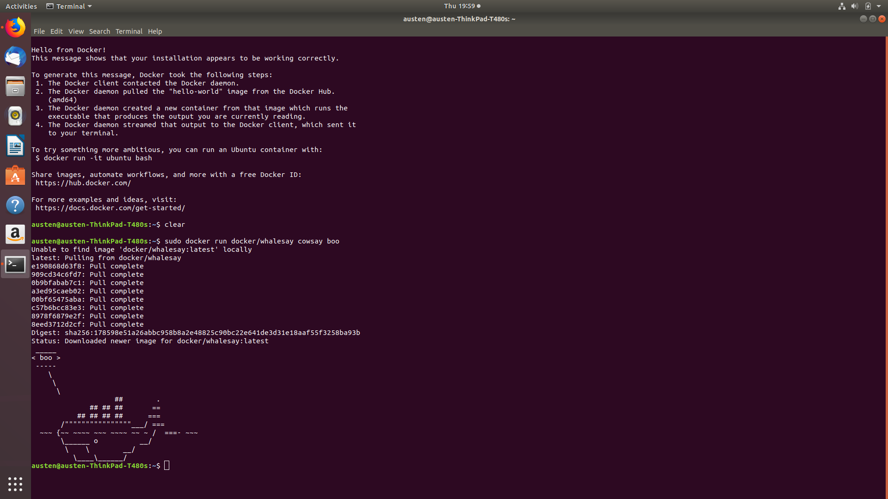
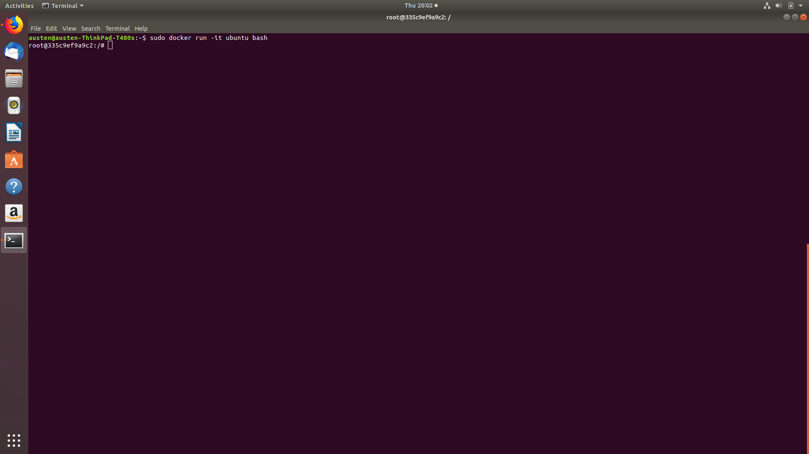
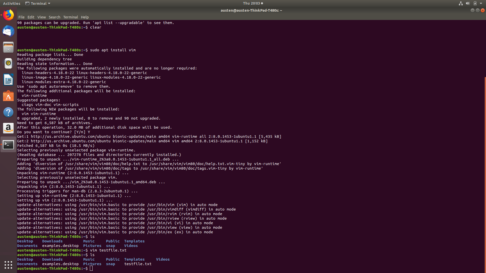
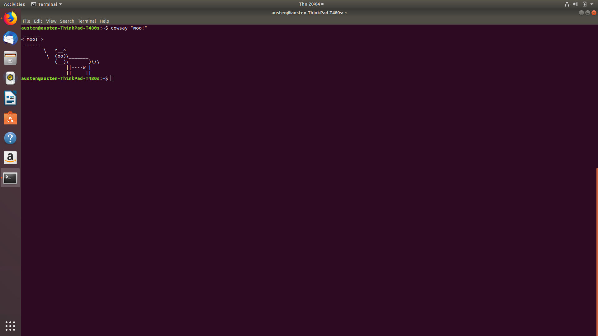
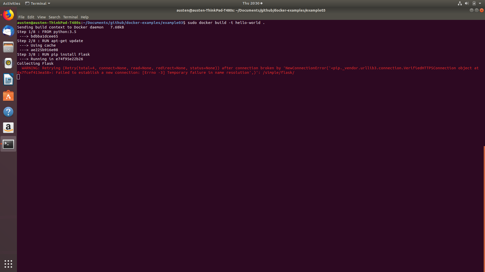
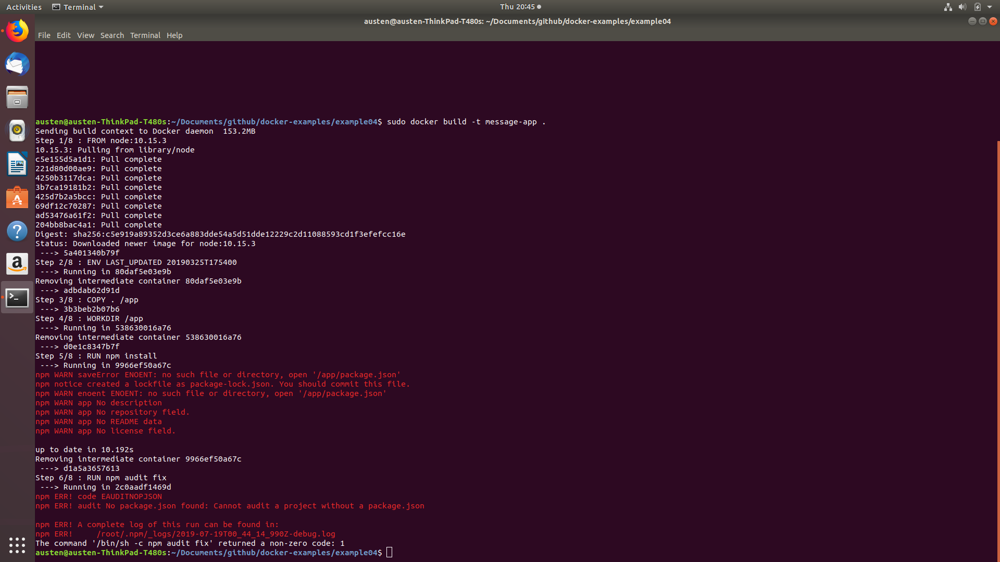
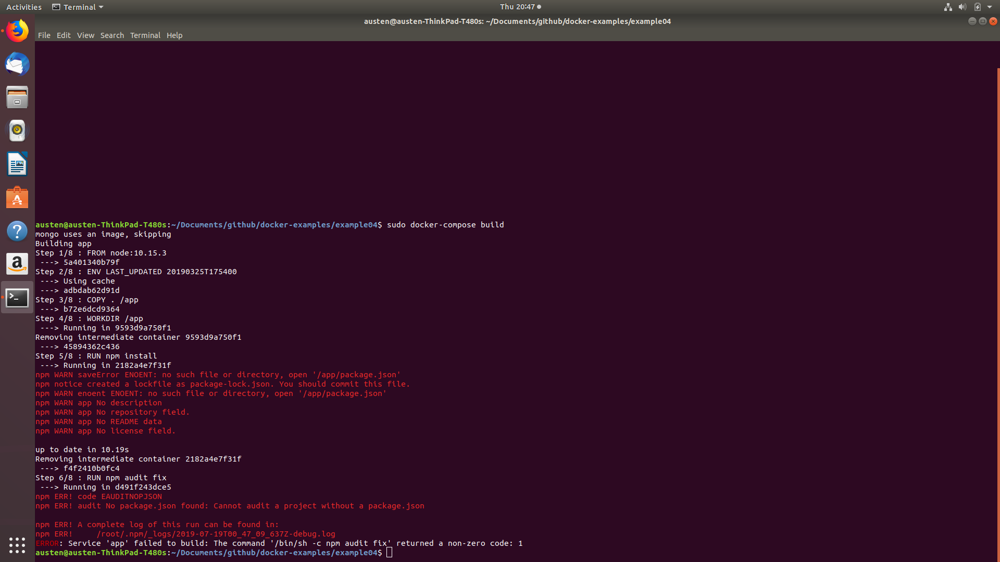

### Example 0: Whalesay

### Example 1: Ubuntu bash

### Example 1: Vim

### Example 1: Cowsay

### Example 2: Rocketchat

### Example 3: Flask failure

### Example 4: Dockerfile failure

### Example 4: docker-compose failure

