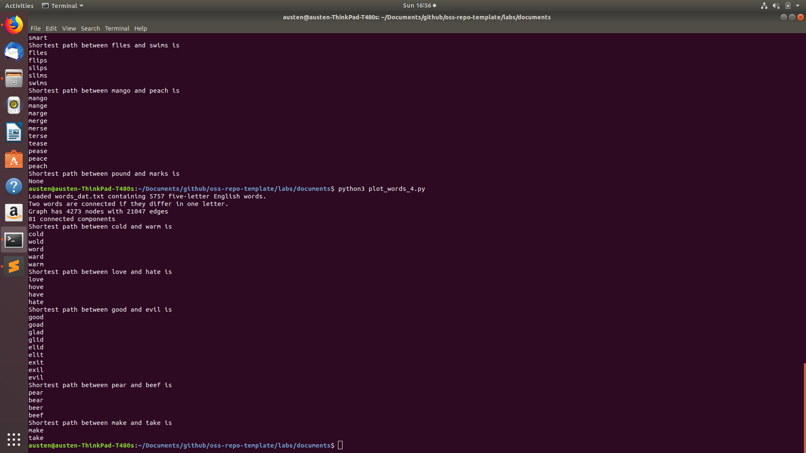
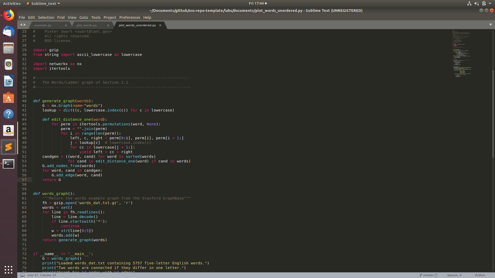

### Part 1: Words of length 5

[Code for part 1](https://github.com/Brin775/oss-repo-template/blob/master/labs/documents/plot_words.py)
### Part 2: Words of length 4

[Code for part 2](https://github.com/Brin775/oss-repo-template/blob/master/labs/documents/plot_words_4.py)
### Part 3: Length 5, order doesn't matter

[Code for part 3](https://github.com/Brin775/oss-repo-template/blob/master/labs/documents/plot_words_unordered.py)
