# Lab 01 Report - Introduction to Open Source Software
# How to Answer Questions in a Helpful Way
1. Be patient
2. Explain where the answer comes from
3. Make sure they're on the right track
# Free Culture, Chapter 3
  I think it's insane how difficult it is for individuals to defend themselves from allegations by big corporations. The fact that Jesse would have needed to pay hundreds of thousands of dollars in order to contest the RIAA is absolutely absurd. Large corporations hold practically all the power in the country, if not the world. Most people are powerless against massive companies and their judicial strength. This case also goes to show the dangers of working with or modifying openly sourced software. Despite the fact that the search engine wasn't intended for music sharing, and that it didn't explicitly incite its users to share music in any way, Jesse was still held accountable. It wasn't even his engine to begin with, but by modifying it in a way that made it more popular and easier to use, he suddenly found himself responsible for every aspect of its use. When working with open source software, legal and moral issues stem not only from licensing and distribution, but from the software's use by customers as well.
# Regex Problems
Problem 1: 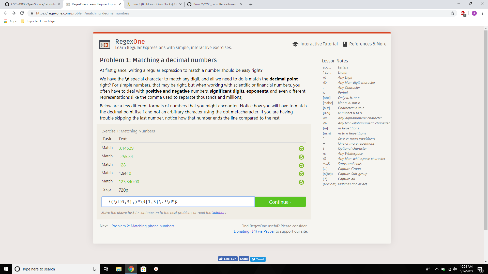
Problem 2: 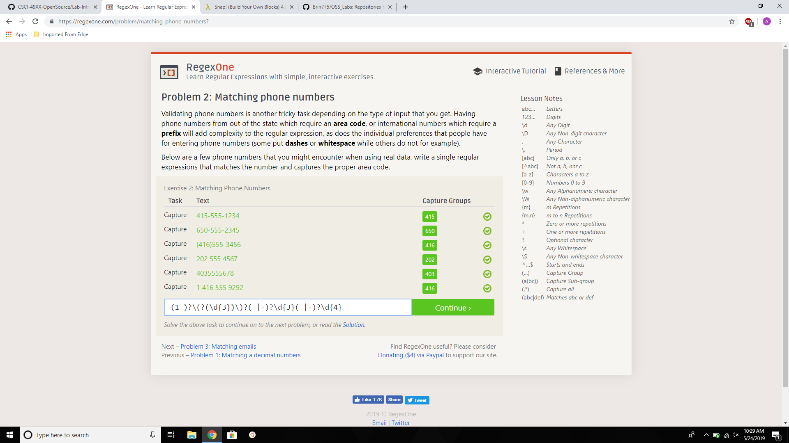
Problem 3: 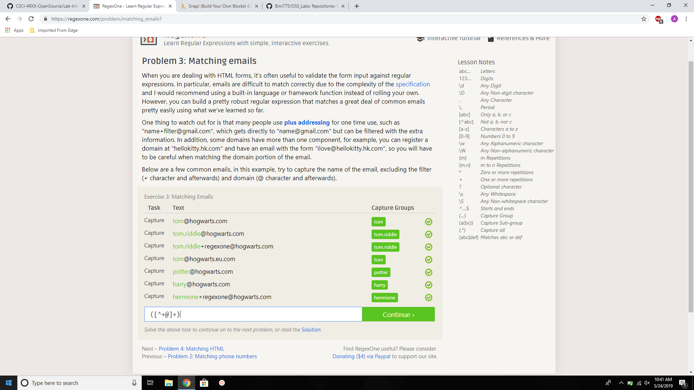
Problem 4: 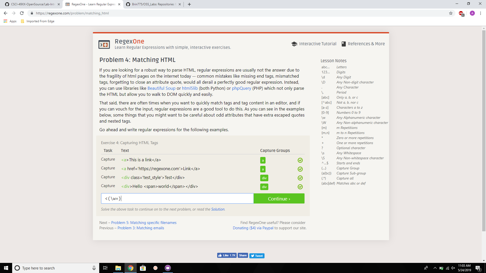
Problem 5: 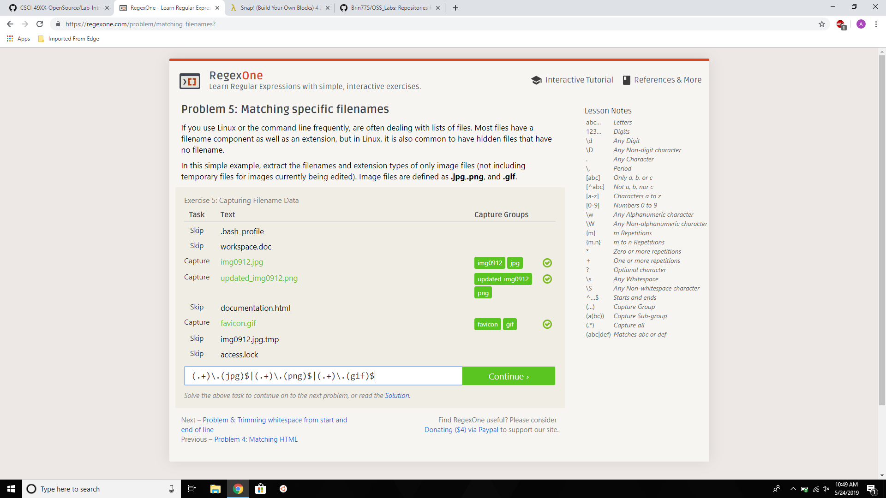
Problem 6: 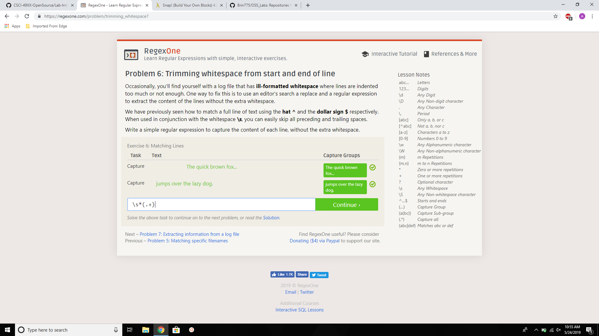
Problem 7: 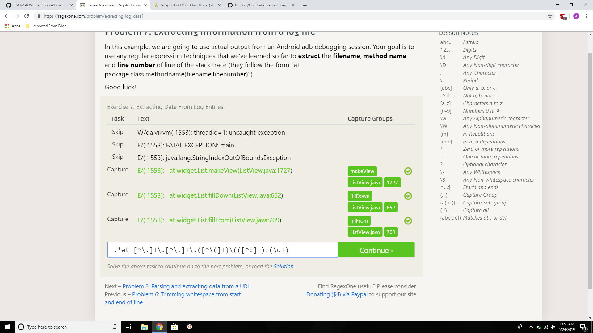
# Cross-regex Problems
Problem 1: 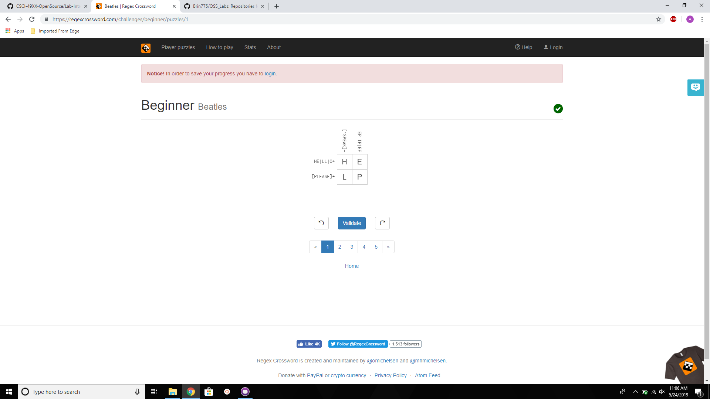
Problem 2: 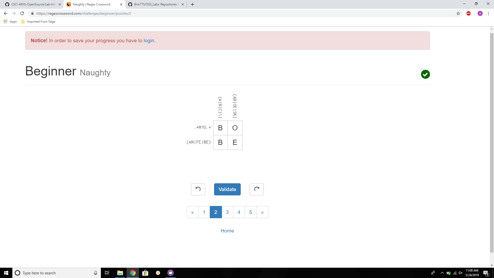
Problem 3: 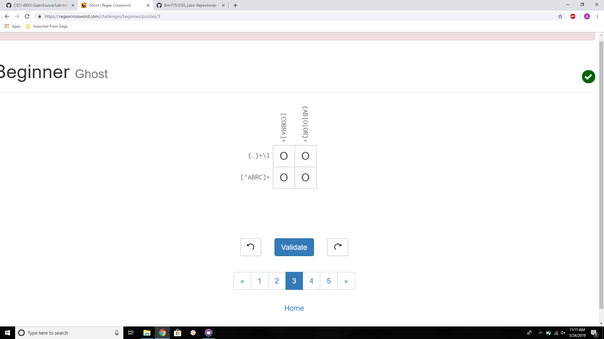
Problem 4: 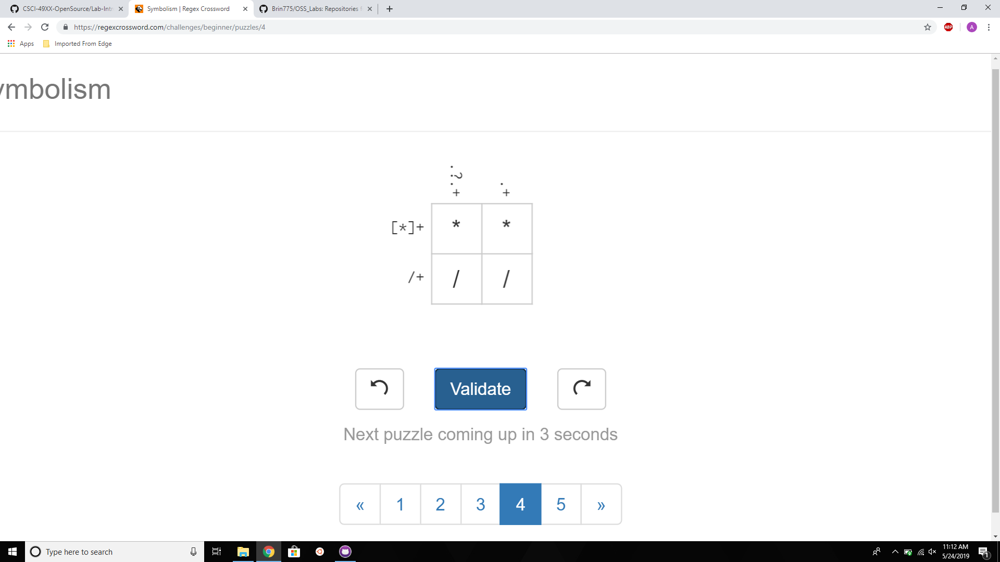
# Blockly
Maze Solution: 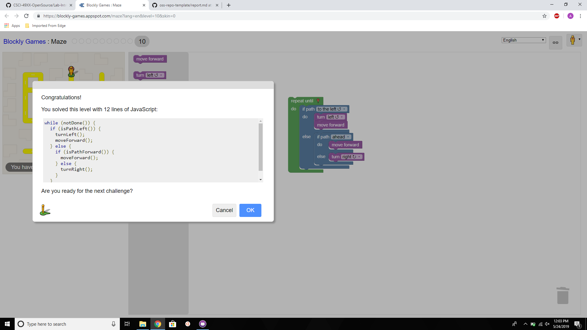
