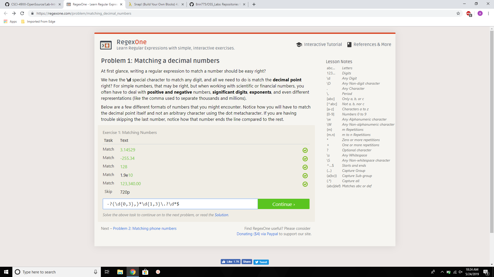
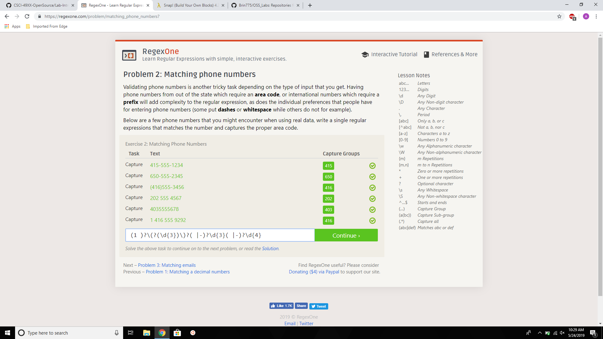
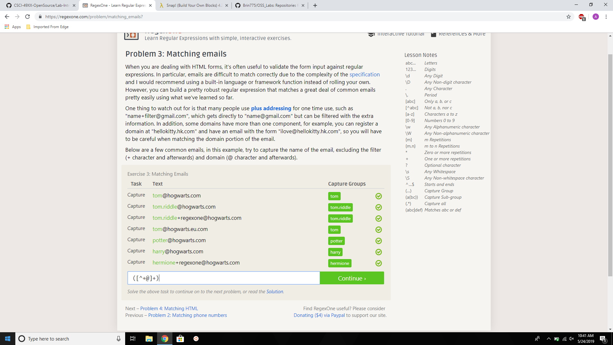
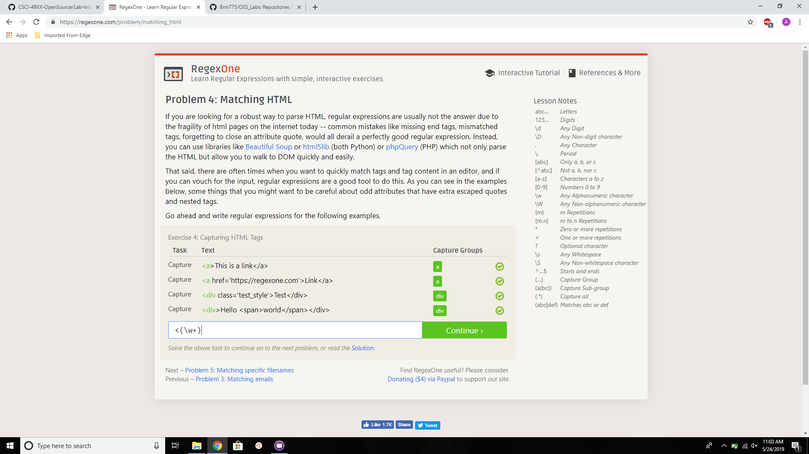
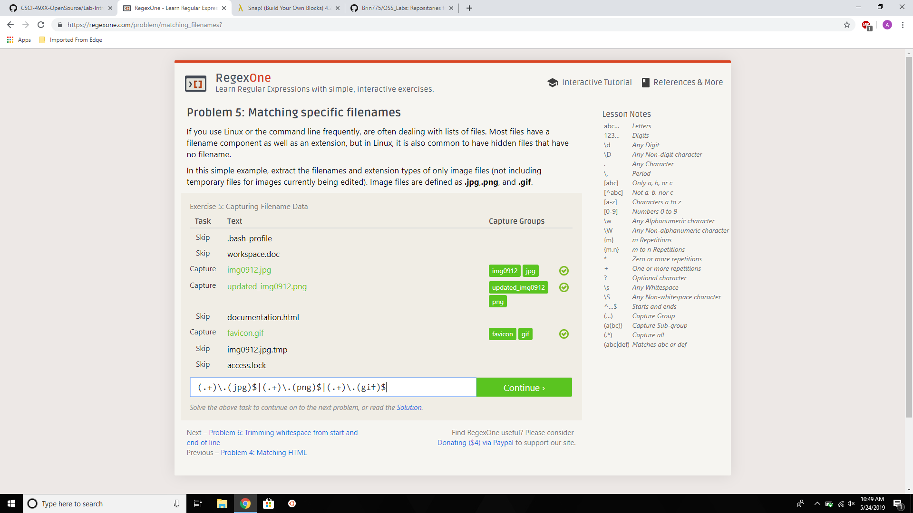
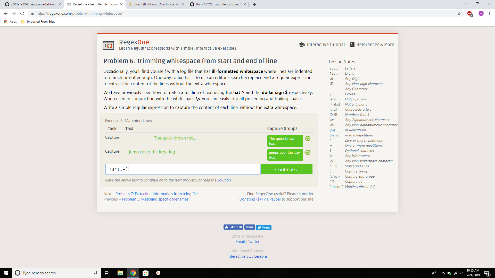
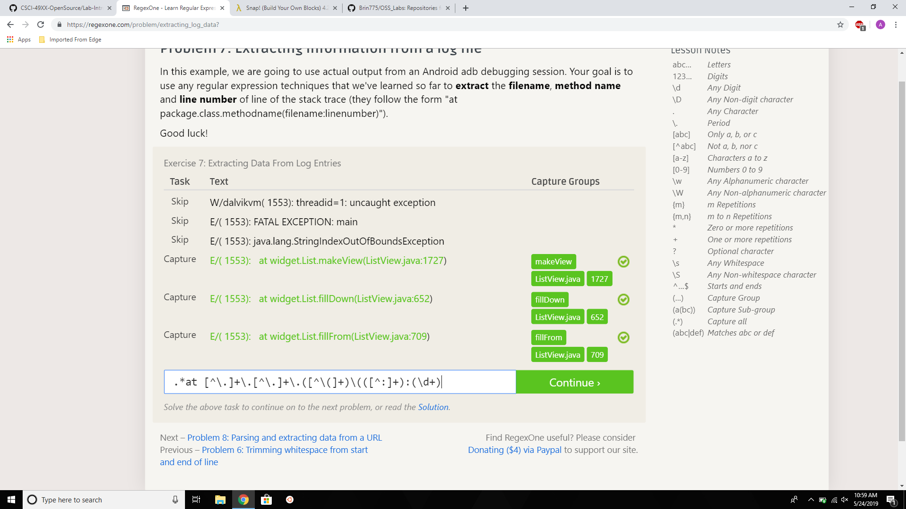
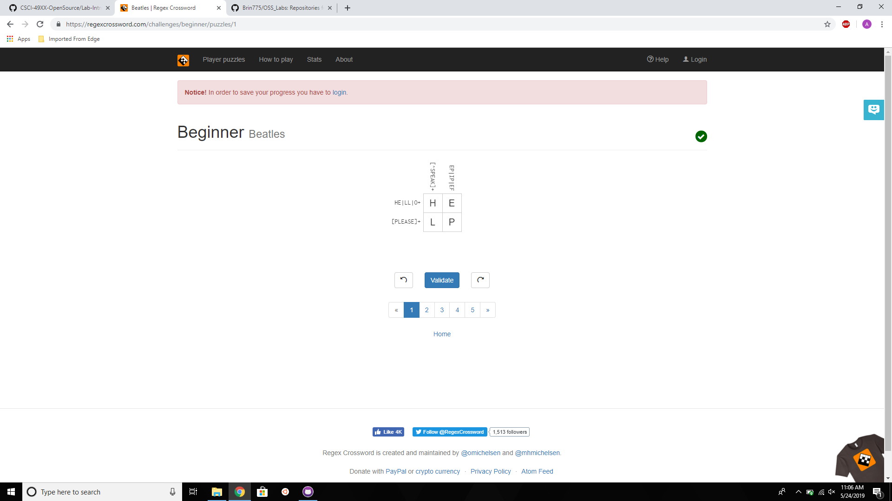
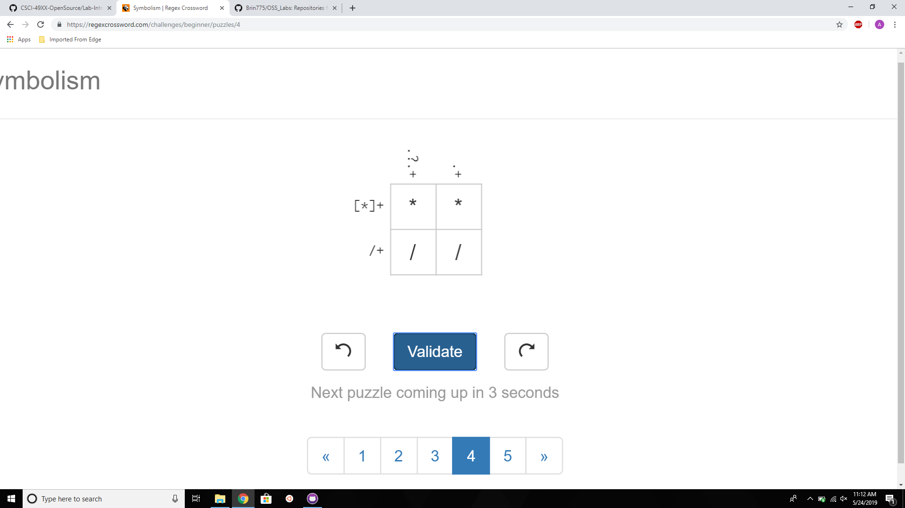
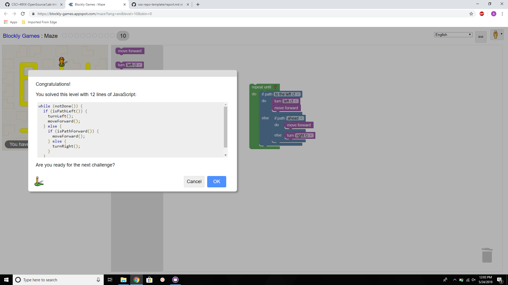

# Lab 01 Report - Introduction to Open Source Software
# How to Answer Questions in a Helpful Way
1. Be patient
2. Explain where the answer comes from
3. Make sure they're on the right track
# Free Culture, Chapter 3
  I think it's insane how difficult it is for individuals to defend themselves from allegations by big corporations. The fact that Jesse would have needed to pay hundreds of thousands of dollars in order to contest the RIAA is absolutely absurd. Large corporations hold practically all the power in the country, if not the world. Most people are powerless against massive companies and their judicial strength. This case also goes to show the dangers of working with or modifying openly sourced software. Despite the fact that the search engine wasn't intended for music sharing, and that it didn't explicitly incite its users to share music in any way, Jesse was still held accountable. It wasn't even his engine to begin with, but by modifying it in a way that made it more popular and easier to use, he suddenly found himself responsible for every aspect of its use. When working with open source software, legal and moral issues stem not only from licensing and distribution, but from the software's use by customers as well.
# Regex Problems
Problem 1: 
Problem 2: 
Problem 3: 
Problem 4: 
Problem 5: 
Problem 6: 
Problem 7: 
# Cross-regex Problems
Problem 1: 
Problem 2: 
Problem 3: 
Problem 4: 
# Blockly
Maze Solution: 
# Reflection
I looked into an open source game engine project on github called Godot. It seems like a good candidate because there is already a flow of users submitting bug reports and feature requests to github, and there seems to be a good range of easy and difficult fixes to implement. The engine is coded in C++, which is a language that I'm personally very familiar with. Also, an open source game engine has an interesting workflow in that the "customers" are using the engine to make their own product for their own customers, so it's almost like adding another level to the development hierarchy.
