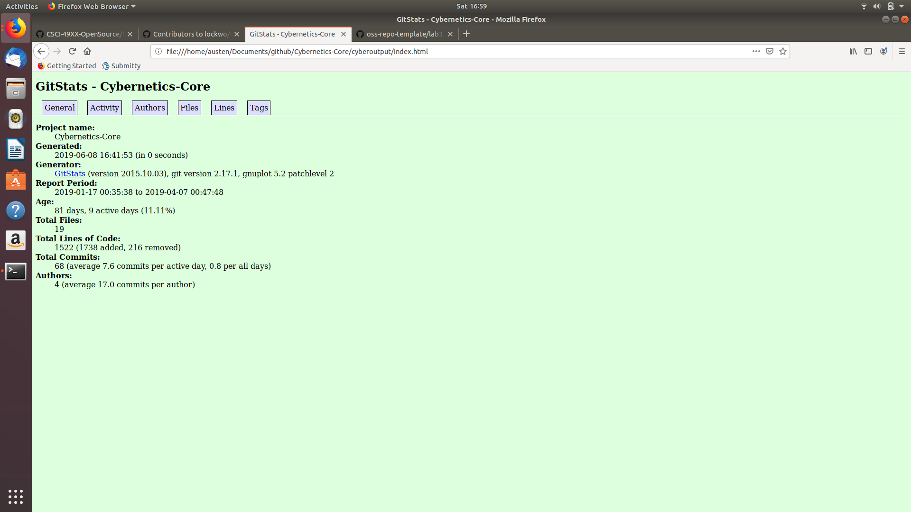
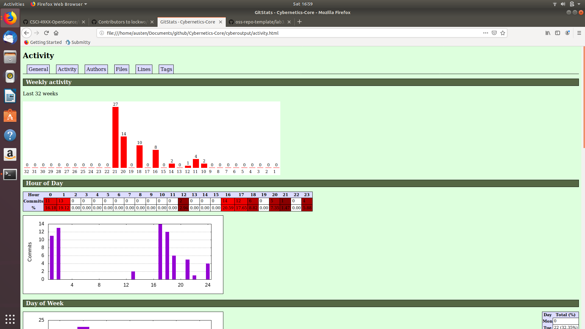
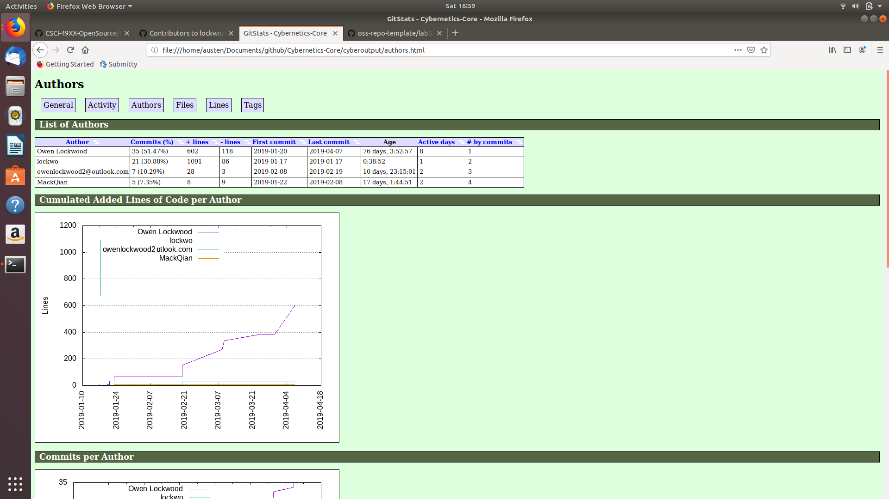
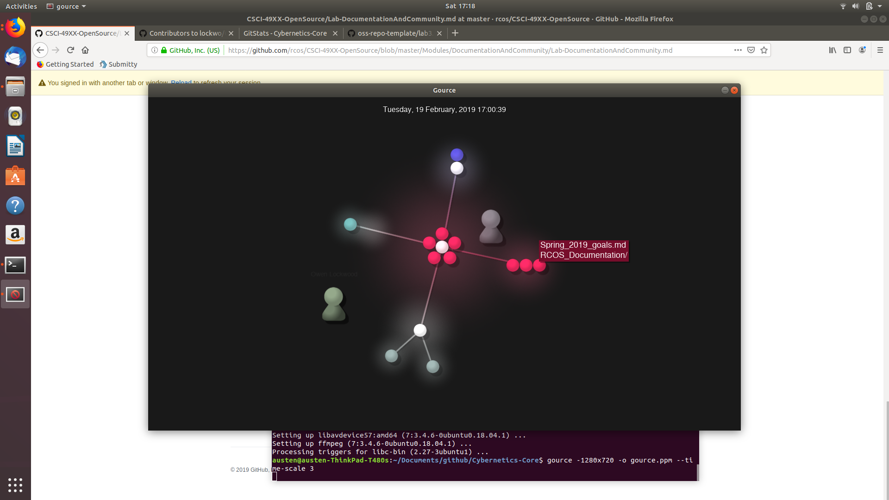
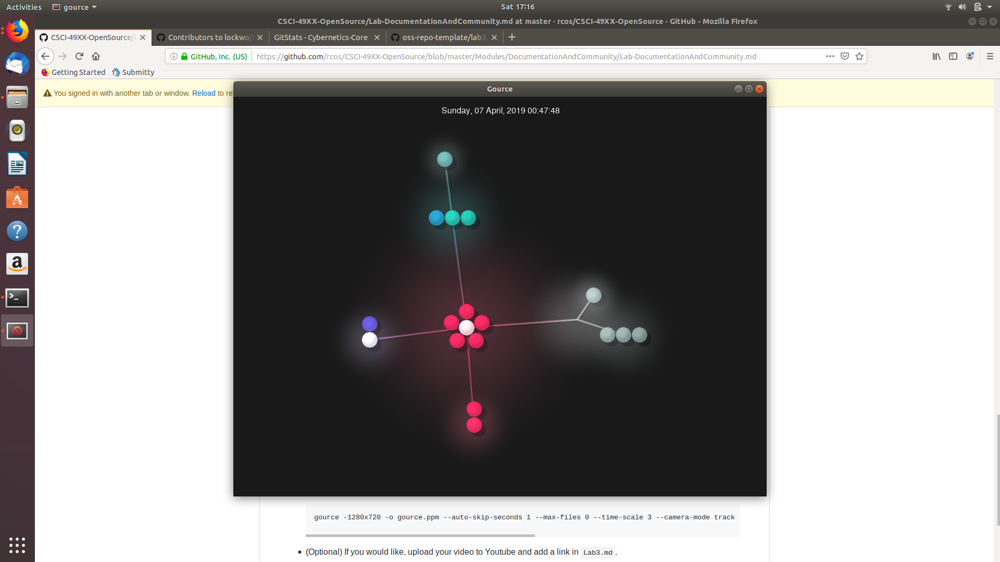

# Latex File:
[Latex_file](documents/OSS_Lab_3.pdf)
# Project info:
Project: Cybernetics-Core\
Contributors: 2\
Lines of Code: 11,352\
First Commit: January 17th, 2019\
Latest Commit: April 7th, 2019\
Current Branches: 1
# Github analysis vs. gitstats
There are a lot of clear differences in the stats being displayed. For instance, github lists only 2 contributors where gitstats lists 4. Also, gitstats lists a far lower number of total lines of code of 1,522, while the command git ls-files -z | xargs -0 wc -l reported 11,352 lines. It seems like gitstats provides a much more accurate and in-depth analysis of a repo then what is immediately visible on github. 
# gitstats Info:
### General Info Tab:

Displays some info on this stats page and general info on the repo.
### Activity Tab:

Info on commit history and when commits are typically made.
### Authors Tab:

Breakdown of when and how often authors have contributed.
# gource Screenshots:

Visualization of authors making commits

Current state of the master branch
